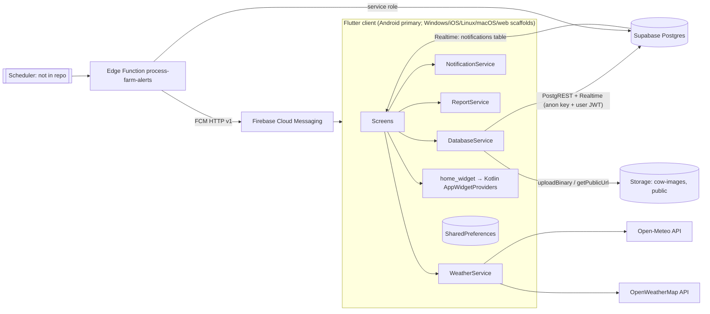

# Architecture

How the KRB Dairy Farms app is put together at runtime. For the data model see
[`DATABASE.md`](DATABASE.md); for defects see [`KNOWN_ISSUES.md`](KNOWN_ISSUES.md).

## 1. System overview

There's no custom backend server. The client talks directly to Supabase with the public anon key,
so **authorisation depends entirely on Supabase RLS policies**, and those aren't in this repository.

## 2. Startup sequence (`lib/main.dart`)

1. On Android and iOS, `Firebase.initializeApp()` runs and the FCM background handler is registered. The handler shows a
   local notification.
2. `NotificationService.init()`: sets the timezone to `Asia/Kolkata`, sets up the Windows notifier, and
   creates the Android channels `main_channel` and `daily_shifts`.
3. `Supabase.initialize(url, anonKey)` using `AppConstants`.
4. **Stale-session recovery:** the code decodes the cached JWT, and if its project ref differs from the
   configured URL it clears `SUPABASE_PERSIST_SESSION_KEY` and signs out. Then it runs a probe query on
   `cows`, and on `PGRST301` (invalid JWT) it does the same. This exists because the backend project
   was migrated once.
5. It requests notification and exact-alarm permissions. `autoScheduleFromPrefs()` is an empty placeholder.
6. `runApp` with `MultiProvider` (Language, Shortcut, Theme, Privacy), then `DairyDayApp`, then `SplashScreen`.

`SplashScreen` waits 3 seconds, then:
- With no session, it goes to `LoginScreen` (email+password or email OTP, `shouldCreateUser: false`. Users must
  be pre-provisioned in Supabase Auth, since there is no sign-up flow).
- With a session, it optionally runs a biometric check (`BiometricService`), then goes to `MainNavigationScreen`.

## 3. Navigation

`MainNavigationScreen` holds an `IndexedStack` of 5 tabs (all tabs stay mounted, so their streams stay subscribed):

| Index | Tab | Screen |
| --- | --- | --- |
| 0 | Dashboard | `DashboardScreen` |
| 1 | Milk | `MilkHistoryScreen` |
| 2 | Cows | `CowListScreen` → `CowDetailScreen`, `AddCowScreen` |
| 3 | Finance | `PaymentsExpensesScreen` → payment/expense detail and add screens |
| 4 | Alerts | `CalvingAlertsScreen` |

Everything else uses imperative `Navigator.push(MaterialPageRoute(...))`. There's no router and no named routes.
Entry points:
- **`GlobalDrawer`**: Weather, Maternity Alerts, Farm Calendar, Vet Contacts, Reminders
  (`CustomAlertScreen`), Budget Manager, Settings, and the language toggle.
- **Dashboard quick actions** (`dashboard_screen.dart`, the switch near line 530): user-configurable via
  `ShortcutManagerScreen` / `ShortcutProvider`. They route to Milk Entry, Add Expense/Payment/Cow,
  breeding, medical record, reports, weather, sell, dry-off, to-do, purchase, and `AlertsManagerScreen`.
- **Android home widgets**: `HomeWidget.widgetClicked` deep links with host `widget` and a last path
  segment of `add_milk`, `add_expense`, or `add_payment`.

## 4. Feature → code map

| Feature | Screens | Service / table |
| --- | --- | --- |
| Milk entry per shift (+ fat%, SNF, per-cow estimates) | `milk_entry_screen`, `milk_entry_success_screen`, `milk_history_screen` | `shift_milk_entries` (upsert on date+shift), `cow_milk_estimates` |
| Herd management | `cow_list_screen`, `cow_detail_screen`, `add_cow_screen`, `confirm_image_screen` | `cows`, storage `cow-images` |
| Buy / sell / dry-off | `purchase_cow_screen`, `sell_cow_screen`, `drying_off_screen` | `cows` + `expenses` / `payments` |
| Breeding and calving | `add_breeding_record_screen`, `global_add_breeding_screen`, `calving_alerts_screen` | `breeding_records` (+283-day calc) |
| Health | `add_health_record_screen`, `global_add_health_record_screen`, `health_record_detail_screen` | `health_records` |
| Finance | `payments_expenses_screen`, `add_payment_screen`, `add_expense_screen`, `*_detail_screen`, `budget_manager_screen` | `payments`, `expenses`, `monthly_budgets` |
| Dashboard KPIs and charts | `dashboard_screen` | `getDashboardDataStream()` combines 6 table streams; `milk_goals` |
| Tasks | `todo_list_screen` | `todo_list` + local scheduled reminders |
| Reminders | `custom_alert_screen`, `alerts_manager_screen` | `custom_alerts`, `notifications` |
| Vets | `vet_contacts_screen` | `vet_contacts` |
| Reports | `reports_screen` | `ReportService` (financial, milk, health, and cow profile as PDF or Excel, shared via share sheet) |
| Weather / heat stress | `weather_screen`, dashboard card | `WeatherService` (location in prefs, default Paramathi Velur) |
| Farm calendar notes | `farm_calendar_screen` | **SharedPreferences `farm_notes` only, device-local and not synced** |
| Settings | `settings_screen`, `privacy_policy_screen`, `terms_conditions_screen` | theme, privacy (hide balances), biometric, sign out |

## 5. Data flow patterns

- **Realtime lists:** `DatabaseService.get*Stream()` wraps `supabase.from(t).stream(primaryKey: ['id']).order(...)`.
  Each call opens a new Realtime channel. Screens often call it inside `build()`, so a rebuild
  (for example, typing in a search box) re-subscribes. Hoist the stream into `initState` in new code.
- **Dashboard aggregation:** `getDashboardDataStream()` uses `rxdart` `CombineLatestStream.combine6`
  over full-table streams (cows, milk, payments, expenses, breeding, health) and computes every KPI
  client-side (today/yesterday milk, 7-day trend, fat/SNF trend, 6-month growth, 12-month in/out,
  expense categories, breed mix, health mix, next 3 calvings). The cost grows with total history.
- **Multi-step writes** (sell cow, purchase cow, recurring-expense materialisation, per-cow estimate
  replace) are sequential client calls with no transaction or RPC.
- **Errors:** screens pass `snapshot.error` to `GlobalErrorView`, which uses `ErrorHandler.handle` to classify
  the error (internet, timeout, database with code 42501 RLS or 23505 duplicate, storage, auth).

## 6. Notifications pipeline

There are three independent paths:

1. **Server alerts:** `process-farm-alerts` (must be triggered by an external scheduler such as
   `pg_cron` + `pg_net` or a Supabase scheduled function; the trigger is **not** in the repo):
   - Due `custom_alerts` for today (IST) whose `alert_time` has passed become `notifications` rows,
     and the alert is set to `is_dismissed = true`.
   - `breeding_records` with `breeding_date` exactly 276 days ago produce a calving notification,
     de-duplicated by `payload.breeding_id`.
   - It then sends FCM pushes to **every** token in `user_push_tokens`, once per notification per token.
2. **Realtime in-app:** `MainNavigationScreen` subscribes to `notifications`. When the newest row is
   unread and created after app launch, it shows a local notification and marks the row `is_read`.
   This is a global flag, so the first device to see it marks it read for everyone.
3. **Local schedules:** daily shift reminders (IDs 1001/1002, channel `daily_shifts`), to-do start/end
   reminders (`id.hashCode`, `+1`), and a test notification. On Windows, "scheduled" notifications show immediately.

FCM tokens are registered on launch and on refresh into `user_push_tokens` (`user_id`, `push_token`, `device_platform`).

## 7. Android home widgets

`DashboardScreen._syncHomeWidget()` writes `today_milk`, `total_cows`, `net_profit` via
`HomeWidget.saveWidgetData`, then refreshes `DairyWidgetProvider`, `MilkWidgetProvider`,
`CowsWidgetProvider`, and `ProfitWidgetProvider`. The Add Milk/Expense/Payment widgets are launchers
that deep link back into the app. All 7 providers are in
`android/app/src/main/kotlin/com/krbdairyfarms/app/DairyWidgetProvider.kt`, and their layouts are in
`res/xml/widget_info*.xml`. `MainActivity` extends `FlutterFragmentActivity` because `local_auth` requires it.

## 8. Local persistence (SharedPreferences keys)

| Key | Owner |
| --- | --- |
| `isDarkMode` | `ThemeProvider` |
| `hideBalances` | `PrivacyProvider` |
| `selected_shortcuts` | `ShortcutProvider` |
| `milk_reminders`, `m_hour`, `m_min`, `e_hour`, `e_min` | `AlertsManagerScreen` |
| `weather_location_name`, `weather_lat`, `weather_lon` | `WeatherService` |
| `farm_notes` | `FarmCalendarScreen` |
| `biometric_enabled` | `BiometricService` |
| `SUPABASE_PERSIST_SESSION_KEY` | supabase_flutter session (cleared by recovery logic) |

The language choice is **not** persisted and resets to English on every launch.

## 9. Platforms

The code gates on `Platform.isAndroid`, `isIOS`, and `isWindows`, and imports `dart:io`, so **web will not work**.
Android is the production target (release signing via `android/key.properties`, `google-services.json`
present). Windows is used for desktop testing (it has `local_notifier`). iOS, macOS, and Linux folders are scaffolds.
There's no `GoogleService-Info.plist`, so Firebase init fails (caught and logged) on iOS.
